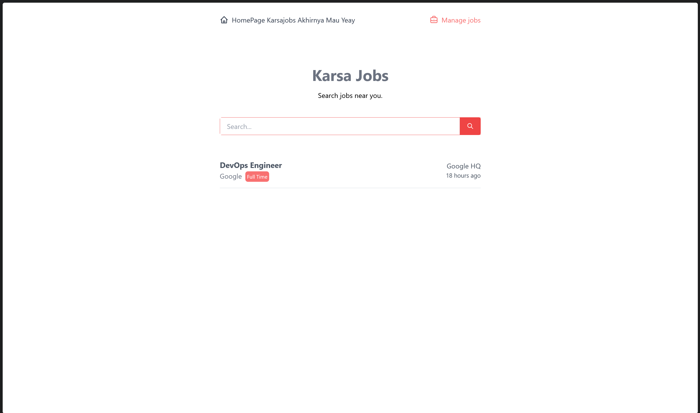
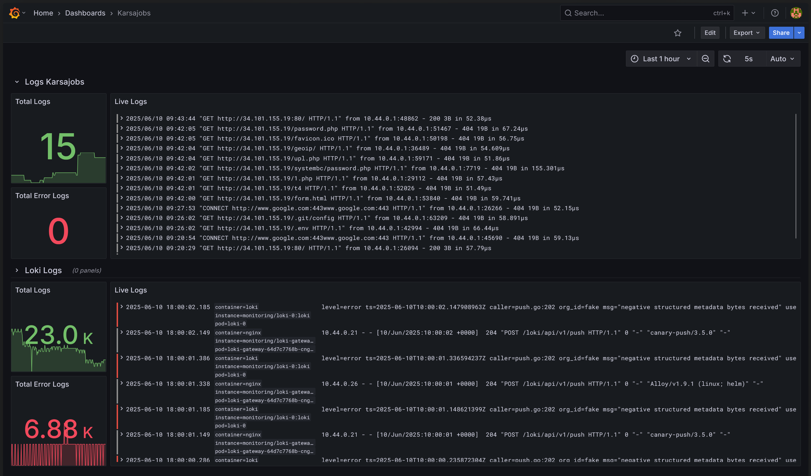

# Devsecops Pipeline and Deployment 

This is a personal DevSecOps project built as part of my university coursework in IT Audit and Information Security. This project showcases a 3-tier application deployment to a Google Kubernetes Engine (GKE) cluster using Terraform and a fully automated CI/CD pipeline with integrated security and monitoring.

## Project Overview

- **Infrastructure as Code (IaC) :** Terraform provisions a custom VPC, subnets, GKE cluster (Stable release channel), dedicated node pool with auto-repair, and a static IP for LoadBalancer services on Google Cloud Platform (GCP).

- **Application :** A 3-tier web application (originally from a Dicoding IDCAMP 2022 course) deployed to GKE, evolved from a Minikube setup to a cloud-based, scalable solution.

- **CI/CD Pipeline :** GitLab CI with self-hosted runners automates linting, testing, Docker image builds, security scanning, and deployments to Kubernetes via kubectl and Helm.

- **Security :** Integrated SAST with SonarQube, SCA, and image scanning with Trivy to ensure secure code and container images.

- **Monitoring :** Helm-deployed Prometheus and Grafana for real-time observability of application logs and metrics.

## Pipeline Architecture


#### Infrastructure (GCP with Terraform)

- Custom VPC and subnets for network isolation. GKE cluster with a dedicated node pool (auto-repair enabled). Static IP for LoadBalancer services. All resources provisioned using Terraform for reproducibility.

#### Application Deployment (Kubernetes)
- 3-tier job management web app (karsajobs) deployed via Kubernetes manifests. Helm charts for simplified deployment of monitoring stack (Prometheus, Grafana).
- Automated deployments and manual rollback mechanisms for stability.

#### CI/CD Pipeline (GitLab CI)

- Parent-child pipeline triggered on directory-level changes. 
- Stages: linting, testing, Docker image build, SAST (SonarQube), SCA/image scanning (Trivy), push to GitHub Container Registry (GHCR), and Kubernetes deployment. 
- Rollback mechanism for each service to ensure deployment reliability.

#### Security (DevSecOps)

- SonarQube: Static Application Security Testing (SAST) to detect code vulnerabilities.
- Trivy: Software Composition Analysis (SCA) and container image scanning to identify CVEs. Automated build rejection for critical vulnerabilities.

#### Monitoring:
- Prometheus for metrics collection.
- Grafana for visualizing application logs and performance metrics.


## Getting Started

### 1. Prerequisites:
- GCP account with billing enabled.
- Service Account for Gitlab Runner
- Terraform, kubectl, Helm, and GitLab Runner installed.
- Access to GitHub Container Registry (GHCR).

### 2. Set Up Infrastructure

```bash
cd terraform
terraform init
terraform apply
```

### 3. Deploy Application
- Configure GitLab CI with self-hosted runners (I used VM to run the runner, but it also can be included in the cluster).
- Push code to trigger the CI/CD pipeline.
- Or Deploy Manually by using Application k8s

```bash
# create mongo-secret.yml 
kubectl create secret generic mongo-secret \
  --from-literal=MONGO_ROOT_USERNAME=<ADD USER HERE> \
  --from-literal=MONGO_ROOT_PASSWORD=<ADD PASS HERE> \
  -n karsajobs

kubectl apply -f ./kubernetes/mongodb
kubectl apply -f ./kubernetes/backend
kubectl apply -f ./kubernetes/frontend
```




### 4. Deploy Monitoring Tools
- Deploy monitoring tools using Helm

```bash
helm repo add grafana https://grafana.github.io/helm-charts
helm repo update
helm install loki grafana/loki -n monitoring -f ./kubernetes/monitoring/loki.yaml
helm install grafana-alloy grafana/alloy -n monitoring -f ./kubernetes/monitoring/alloy.yaml
helm install grafana grafana/grafana -n monitoring -f ./kubernetes/monitoring/grafana.yaml
```
- Access Grafana dashboards for real-time logs.
- Explore Loki as Data Source for application logs.
- Get creative with the dashboard




### 5. Set Up SonarQube
- Install SonarQube for security scanning (This time I installed it on vm, but it can be included in cluster too).
- Create Project from Gitlab in Sonarqube 
- After set it up, copy the properties into sonar-project.properties
- Copy Sonar Host Url and Sonar Token and Add it into Gitlab Variable
- Run the pipeline to check

